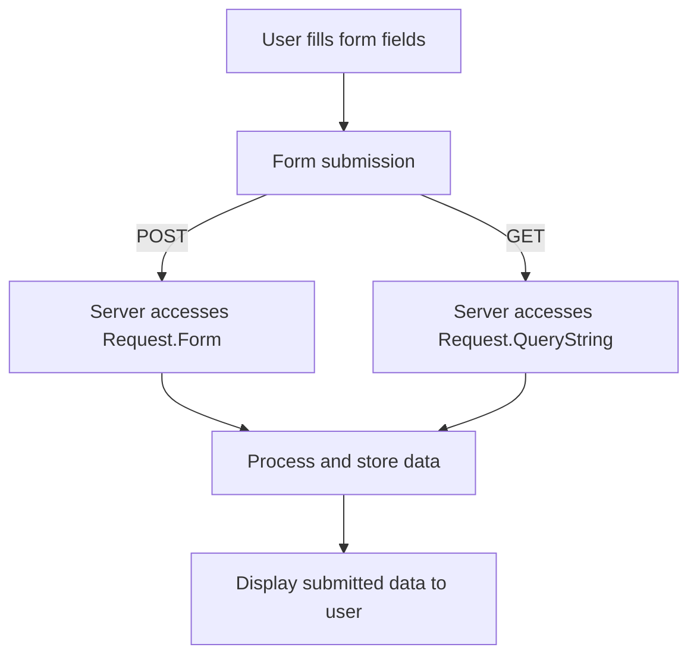

# Basic Concepts of Forms in User Interaction

Forms are fundamental components in web applications used to gather user input through various interactive fields such as text inputs, textareas, checkboxes, and radio buttons. They enable users to submit data that the server can process or store.

# Form Submission Methods

In this codebase, forms utilize both GET and POST HTTP methods to submit data. The GET method appends form data to the URL as query parameters, making it visible in the address bar, while the POST method sends data within the HTTP request body, keeping it hidden from the URL. The choice between these methods influences how the server retrieves the submitted data.

# Accessing Submitted Form Data

When a form is submitted using the POST method, the server accesses the data through the <SwmToken path="form-post.asp" pos="23:7:9" line-data="  Title : &lt;%= Request.Form(&quot;title&quot;) %&gt; &lt;br/&gt;">`Request.Form`</SwmToken> collection, which contains key-value pairs representing the form fields and their values. Conversely, for forms submitted via GET, the data is accessed using the <SwmToken path="form-get.asp" pos="23:7:9" line-data="  Title : &lt;%= Request.QueryString(&quot;title&quot;) %&gt; &lt;br/&gt;">`Request.QueryString`</SwmToken> collection, which retrieves values from the URL's query parameters. Both collections allow the server to extract user input by referencing the input field names.

# Handling Multiple Input Types

The forms in this repository demonstrate handling various input types. For example, text fields collect simple text data like titles and content. Checkboxes allow users to select multiple categories, while radio buttons enable selection of a single status option. This variety showcases how different input controls are integrated and processed within the forms.

# Displaying Submitted Data

After form submission, the application reflects the submitted data back to the user by embedding the retrieved values directly into the response page. This immediate feedback confirms the data received by the server and enhances user interaction.

<SwmSnippet path="/form-post.asp" line="1">

---

The file <SwmPath>[form-post.asp](form-post.asp)</SwmPath> contains a form that uses the POST method to collect user input including a title, content, categories via checkboxes, and status via radio buttons. Upon submission, the page accesses the submitted data using <SwmToken path="form-post.asp" pos="23:7:9" line-data="  Title : &lt;%= Request.Form(&quot;title&quot;) %&gt; &lt;br/&gt;">`Request.Form`</SwmToken> and displays the values back to the user, illustrating the POST data handling process.

```asp
<!--#include file="layouts/header.asp"-->

  <h1>Form POST</h1>

  <form method="POST" action="form-post.asp">
    Title<br/>
    <input type="text" name="title" placeholder="title"/> <br/>
    Content<br/>
    <textarea name="content" placeholder="content"></textarea> <br/>
    Category : 
    <input type="checkbox" name="category" value="news"/> News 
    <input type="checkbox" name="category" value="event" /> Event <br/>
    Status : 
    <input type="radio" name="status" value="published"/> Published 
    <input type="radio" name="status" value="draft" /> Draft <br/><br/>
    <button>Submit</button>
  </form>

  <hr/>

  <h1>Form POST Response</h1>

  Title : <%= Request.Form("title") %> <br/>
  Content : <%= Request.Form("content") %> <br/>
  Category : 
  <%= Request.Form("category") %> <br/>
  
  Status : <%= Request.Form("status") %> <br/>

<!--#include file="layouts/footer.asp"-->


```

---

</SwmSnippet>

<SwmSnippet path="/form-get.asp" line="1">

---

Similarly, <SwmPath>[form-get.asp](form-get.asp)</SwmPath> implements a form using the GET method to collect the same set of inputs. The submitted data is accessed through <SwmToken path="form-get.asp" pos="23:7:9" line-data="  Title : &lt;%= Request.QueryString(&quot;title&quot;) %&gt; &lt;br/&gt;">`Request.QueryString`</SwmToken> and displayed on the page, demonstrating how GET submissions are processed and rendered.

```asp
<!--#include file="layouts/header.asp"-->

  <h1>Form GET</h1>

  <form method="GET" action="form-get.asp">
    Title<br/>
    <input type="text" name="title" placeholder="title"/> <br/>
    Content<br/>
    <textarea name="content" placeholder="content"></textarea> <br/>
    Category : 
    <input type="checkbox" name="category" value="news"/> News 
    <input type="checkbox" name="category" value="event" /> Event <br/>
    Status : 
    <input type="radio" name="status" value="published"/> Published 
    <input type="radio" name="status" value="draft" /> Draft <br/><br/>
    <button>Submit</button>
  </form>

  <hr/>

  <h1>Form GET Response</h1>

  Title : <%= Request.QueryString("title") %> <br/>
  Content : <%= Request.QueryString("content") %> <br/>
  Category : 
  <%= Request.QueryString("category") %> <br/>
  
  Status : <%= Request.QueryString("status") %> <br/>

<!--#include file="layouts/footer.asp"-->


```

---

</SwmSnippet>

# Summary of Form Data Flow

The typical flow begins with user interaction on the form fields, followed by submission via GET or POST. The server then retrieves the data using the appropriate collection (<SwmToken path="form-get.asp" pos="23:7:9" line-data="  Title : &lt;%= Request.QueryString(&quot;title&quot;) %&gt; &lt;br/&gt;">`Request.QueryString`</SwmToken> or <SwmToken path="form-post.asp" pos="23:7:9" line-data="  Title : &lt;%= Request.Form(&quot;title&quot;) %&gt; &lt;br/&gt;">`Request.Form`</SwmToken>), processes it, and finally renders the submitted values back to the user. This flow ensures seamless user interaction and data handling within the application.



&nbsp;

*This is an auto-generated document by Swimm 🌊 and has not yet been verified by a human*

<SwmMeta version="3.0.0" repo-id="Z2l0aHViJTNBJTNBbGVhcm4tY2xhc3NpYy1hc3AlM0ElM0FtdWRhc2luMQ==" repo-name="learn-classic-asp"><sup>Powered by [Swimm](https://app.swimm.io/)</sup></SwmMeta>
