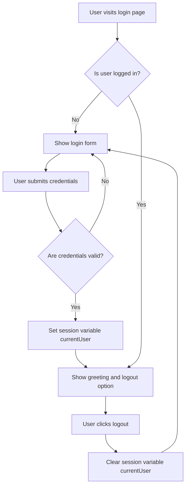

# What is Session Management

Session management is a technique used to maintain the state of a user's interaction with a web application by storing user-specific data on the server side. Since HTTP is a stateless protocol, sessions enable the server to remember information about the user, such as their login status, across multiple requests.

# Importance of Session Management

Session management is essential for user authentication and personalization. It allows the application to recognize returning users without requiring them to log in repeatedly, thereby enhancing the user experience and maintaining security throughout the interaction.

# How Session Management Works in This Application

In this application, the session variable <SwmToken path="session-login.asp" pos="14:4:4" line-data="    Session(&quot;currentUser&quot;) = &quot;&quot;">`currentUser`</SwmToken> is used to track the user's login state. When a user logs in, <SwmToken path="session-login.asp" pos="14:4:4" line-data="    Session(&quot;currentUser&quot;) = &quot;&quot;">`currentUser`</SwmToken> is assigned the username or a predefined identifier representing the user. This session variable persists across multiple page requests, allowing the application to remember the user's identity.

When the user logs out, the session variable <SwmToken path="session-login.asp" pos="14:4:4" line-data="    Session(&quot;currentUser&quot;) = &quot;&quot;">`currentUser`</SwmToken> is cleared, effectively ending the session and requiring the user to authenticate again for further access.

# Conditional Rendering Based on Session State

The application checks the value of <SwmToken path="session-login.asp" pos="14:4:4" line-data="    Session(&quot;currentUser&quot;) = &quot;&quot;">`currentUser`</SwmToken> to determine whether the user is logged in. If <SwmToken path="session-login.asp" pos="14:4:4" line-data="    Session(&quot;currentUser&quot;) = &quot;&quot;">`currentUser`</SwmToken> is empty or undefined, the login form is displayed. Otherwise, the application greets the user by name and provides a logout option. This conditional rendering ensures that users see appropriate content based on their authentication status.

# Session Management in <SwmPath>[session-simple.asp](session-simple.asp)</SwmPath>

In the file <SwmPath>[session-simple.asp](session-simple.asp)</SwmPath>, the session variable <SwmToken path="session-login.asp" pos="14:4:4" line-data="    Session(&quot;currentUser&quot;) = &quot;&quot;">`currentUser`</SwmToken> is set to a fixed string when the user logs in and cleared upon logout. The page logic checks if <SwmToken path="session-login.asp" pos="14:4:4" line-data="    Session(&quot;currentUser&quot;) = &quot;&quot;">`currentUser`</SwmToken> is empty to decide whether to show the login button or a personalized greeting with a logout option.

<SwmSnippet path="/session-login.asp" line="12">

---

The file <SwmPath>[session-login.asp](session-login.asp)</SwmPath> implements a more dynamic session management approach. Upon successful login, after validating user credentials, the session variable <SwmToken path="session-login.asp" pos="14:4:4" line-data="    Session(&quot;currentUser&quot;) = &quot;&quot;">`currentUser`</SwmToken> is set to the username provided by the user. When the user logs out, this session variable is cleared. The page uses this session variable to display either the login form or a personalized greeting with a logout button.

```asp
  If submit = "Logout" Then
    ' remove session
    Session("currentUser") = ""
  ElseIf submit = "Login" Then
    If username = "" Then
      message = message & "username is required <br/>"
    End If
    If password = "" Then
      message = message & "password is required <br/>"
    End If

    ' username and password = "user"
    If username <> "user" and password <> "user" Then
      message = message & "username or password is wrong"
    Else
      Session("currentUser") = username
    End If
  End If
```

---

</SwmSnippet>

# Summary of Session Management Flow

Overall, session management in this application enables persistent user identity across multiple HTTP requests. By storing the user's login state in the session variable <SwmToken path="session-login.asp" pos="14:4:4" line-data="    Session(&quot;currentUser&quot;) = &quot;&quot;">`currentUser`</SwmToken>, the application can conditionally render content and maintain a seamless user experience without requiring repeated authentication.



&nbsp;

*This is an auto-generated document by Swimm 🌊 and has not yet been verified by a human*

<SwmMeta version="3.0.0" repo-id="Z2l0aHViJTNBJTNBbGVhcm4tY2xhc3NpYy1hc3AlM0ElM0FtdWRhc2luMQ==" repo-name="learn-classic-asp"><sup>Powered by [Swimm](https://app.swimm.io/)</sup></SwmMeta>
